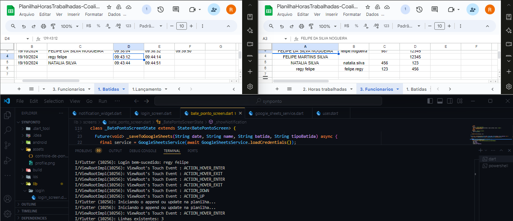

\# BatePonto

O \*\*BatePonto App\*\* é um aplicativo desenvolvido em Flutter que permite aos usuários registrar suas entradas e saídas de trabalho de forma simples e eficiente. Ele integra com o Google Sheets para armazenar os registros de forma organizada.

\### 📋 Pré-requisitos

De que coisas você precisa para instalar o software e como instalá-lo?

- [Flutter](https://flutter.dev/docs/get-started/install)
- [Dart](https://dart.dev/get-dart)

\### 🔧 Instalação

Uma série de exemplos passo-a-passo que informam o que você deve executar para ter um ambiente de desenvolvimento em execução.

1. Clone este repositório:

\```bash

git clone https://github.com/regyfelipe/Registrode-batida-com-spreadsheets.git


### O que foi adicionado

- A imagem foi inserida na seção "Exemplo de Interface do Usuário" com a seguinte linha: 
  ```markdown
  


Termine com um exemplo de como obter dados do sistema ou como usá-los para uma pequena demonstração.

⚙️ Executando os testes

Explicar como executar os testes automatizados para este sistema.


📌 Versão

Nós usamos SemVer para controle de versão. Para as versões disponíveis, observe as tags neste repositório.

✒️ Autores

Mencione todos aqueles que ajudaram a levantar o projeto desde o seu início:

Regy Felipe - Desenvolvedor Principal - regyfelipe

Você também pode ver a lista de todos os colaboradores que participaram deste projeto.

📄 Licença

Este projeto está sob a licença MIT - veja o arquivo LICENSE.md para detalhes.

🎁 Expressões de gratidão

Conte a outras pessoas sobre este projeto 📢;

Convide alguém da equipe para uma cerveja 🍺;

Um agradecimento publicamente 🫂;

etc.
